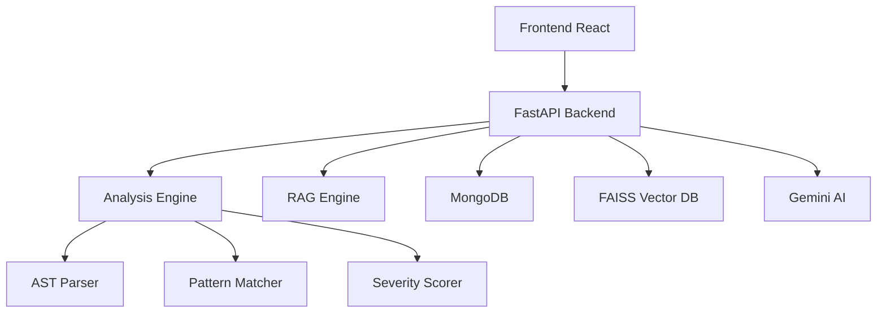

# 🚀 Code Quality Intelligence Agent

> AI-powered code analysis platform that provides comprehensive quality assessment, security vulnerability detection, and intelligent insights for your codebase.

[](https://opensource.org/licenses/MIT)
[](https://www.python.org/downloads/)
[](https://nodejs.org/)
[](https://www.docker.com/)

<a href="https://youtu.be/1DQ3DU7mtOo" target="_blank">
<div style="text-align: center; margin-top: 10px;">
 
<span style="color: #FF0000; font-weight: bold; text-decoration: none;">Watch the DemoCLI Video</span>
</div>
</a>

<a href="https://youtu.be/DiIz1guJSDU" target="_blank">
<div style="text-align: center; margin-top: 10px;">
 
<span style="color: #FF0000; font-weight: bold; text-decoration: none;">Watch the WebApp Video</span>
</div>
</a>

## ✨ Features

### 🎯 Core Capabilities
- **🔍 Multi-Language Analysis**: Python, JavaScript, TypeScript, Java, Go, Rust, C++, C#, Ruby, PHP
- **🤖 AI-Powered Insights**: Advanced analysis using Google Gemini AI
- **💬 Interactive Q&A**: Natural language queries about your codebase
- **📊 Rich Reports**: Comprehensive dashboards with actionable recommendations
- **🔗 GitHub Integration**: Direct repository analysis from GitHub URLs

### 🛡️ Analysis Categories
- **Security**: Vulnerability detection, injection flaws, authentication issues
- **Performance**: Bottlenecks, inefficient algorithms, resource optimization
- **Code Quality**: Duplication, complexity, naming conventions
- **Maintainability**: Technical debt, documentation, test coverage
- **Best Practices**: Language-specific patterns and conventions

### 🔧 Advanced Technology
- **AST Parsing**: Deep structural code analysis
- **RAG Engine**: Vector-based intelligent responses using FAISS
- **Severity Scoring**: Automated issue prioritization
- **Real-time Updates**: Live analysis progress tracking

## 🚀 Quick Start

### Using Docker (Recommended)
```bash
# Clone the repository
git clone <repository-url>
cd code-quality-intelligence-agent

# Configure environment
cp .env.example .env
# Edit .env with your API keys

# Start all services
docker-compose up -d

# Access the application
open http://localhost:3000
```

### Manual Setup
```bash
# Run setup script
chmod +x scripts/setup.sh
./scripts/setup.sh

# Start development servers
make dev
```

## 🛠️ Installation

### Prerequisites
- Python 3.11+
- Node.js 18+
- Docker & Docker Compose
- MongoDB 7.0+

### Environment Configuration
```bash
# Required
GEMINI_API_KEY=your_gemini_api_key_here

# Optional but recommended  
GITHUB_TOKEN=your_github_token_here
```

### Step-by-Step Setup

1. **Backend Setup**
```bash
cd backend
python -m venv venv
source venv/bin/activate  # Windows: venv\Scripts\activate
pip install -r requirements.txt
```

2. **Frontend Setup**
```bash
cd frontend
npm install
```

3. **Database Setup**
```bash
# Using Docker
docker run -d --name mongodb -p 27017:27017 mongo:7.0

# Or install MongoDB locally
```

4. **Start Services**
```bash
# Backend
cd backend && uvicorn app.main:app --reload

# Frontend  
cd frontend && npm start
```

## 💻 Usage

### Web Interface

1. **📁 Upload/Connect Code**
   - Upload zip/tar archives
   - Connect GitHub repositories
   - Select analysis options

2. **⚡ Run Analysis**
   - Real-time progress tracking
   - Multi-language detection
   - Comprehensive scanning

3. **📊 Review Results**
   - Quality scores and metrics
   - Issue categorization
   - Actionable recommendations

4. **💬 Ask Questions**
   - Natural language queries
   - Context-aware responses
   - Source attribution

### CLI Usage

```bash
# Analyze local directory
python -m app.cli analyze /path/to/code

# Analyze GitHub repository
python -m app.cli analyze https://github.com/user/repo

# Interactive Q&A
python -m app.cli qa --report-id abc123

# Export reports
python -m app.cli export abc123 --format json

# Health check
python -m app.cli health
```

### API Usage

```bash
# Start analysis
curl -X POST http://localhost:8000/api/v1/analyze \
  -F "source_type=github" \
  -F "source_path=https://github.com/user/repo"

# Check status
curl http://localhost:8000/api/v1/analyze/{report_id}/status

# Ask questions
curl -X POST http://localhost:8000/api/v1/ask \
  -H "Content-Type: application/json" \
  -d '{"question": "What are the security issues?"}'
```

## 🏗️ Architecture



### Key Components
- **Analysis Engine**: Core code processing and issue detection
- **AST Parser**: Deep structural analysis for supported languages
- **RAG Engine**: Vector-based retrieval for intelligent Q&A
- **Severity Scorer**: Automated risk assessment and prioritization

## 🧪 Testing

```bash
# Run all tests
make test

# Backend only
cd backend && pytest tests/ -v --cov=app

# Frontend only  
cd frontend && npm test

# Integration tests
pytest tests/integration/ -v -m integration
```

## 📚 API Documentation

Interactive API documentation available at:
- Swagger UI: http://localhost:8000/docs
- ReDoc: http://localhost:8000/redoc

### Key Endpoints

| Method | Endpoint | Description |
|--------|----------|-------------|
| POST | `/api/v1/analyze` | Start code analysis |
| GET | `/api/v1/analyze/{id}/status` | Get analysis status |
| GET | `/api/v1/report/{id}` | Retrieve analysis report |
| POST | `/api/v1/ask` | Ask questions about code |

## 🚢 Deployment

### Production Deployment
```bash
# Build and deploy
./scripts/deploy.sh production

# Or using Docker Compose
docker-compose -f docker-compose.prod.yml up -d
```

### Kubernetes
```bash
# Apply manifests
kubectl apply -f k8s/
```

## 🤝 Contributing

1. Fork the repository
2. Create a feature branch (`git checkout -b feature/amazing-feature`)
3. Commit your changes (`git commit -m 'Add amazing feature'`)
4. Push to the branch (`git push origin feature/amazing-feature`)
5. Open a Pull Request

### Development Setup
```bash
# Install pre-commit hooks
pre-commit install

# Format code
make format

# Run lints
make lint
```

## 📄 License

This project is licensed under the MIT License - see the [LICENSE](LICENSE) file for details.

## 🙏 Acknowledgments

- **Google Gemini AI** for advanced code analysis
- **FAISS** for efficient vector similarity search
- **FastAPI** for the robust backend framework
- **React & Material-UI** for the modern frontend
- **MongoDB** for flexible data storage

---

**Built with ❤️ for developers who care about code quality**

*Need help? Check our [documentation](./docs/) or open an [issue](../../issues)*
